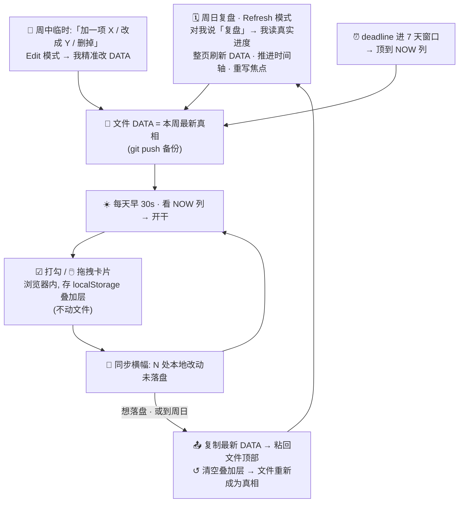

# life-kanban

A Claude Code skill for creating and maintaining a **single-file HTML personal kanban board** — a
"what should I look at / do right now" life + project dashboard.


<sub>Light theme (toggle with 🌗 or persisted per-browser):</sub>


## What it does

| Mode | Trigger | Result |
|---|---|---|
| **Create** | "做个看板" / no board exists | Scaffolds `看板.html` + `dashboard.css` + `dashboard-utils.js` from bundled templates, seeded with your real focus. |
| **Edit** | "加一项" / "打勾" / "挪到今天" / "删掉" | Small precise edits to the top `DATA` block (add/move/complete/remove cards). |
| **Refresh** | "复盘" / "刷新看板" / "进新的一周" | Full-page reset for a new period — rolls columns, advances timeline, rewrites focus & NOT-NOW. |
| **Analyze** | "汇总" / "现在啥情况" / "哪些落后了" | Reads the board and reports per-track counts, NOW load, slips, nearest deadline. |

## Workflow loop · 用法闭环

How the pieces fit in real use: a **weekly big loop** (I refresh the file) wrapped around a **daily
micro-loop** (you tick/drag in the browser), with mid-week edits and deadline promotion feeding the
file. The file `DATA` is canonical; browser edits live in a localStorage overlay until synced back.



- **周日** 我做整页 Refresh,文件回到唯一真相。
- **每天** 你只在浏览器里勾/拖,改动攒在叠加层(横幅显示有几处未落盘)。
- **周中** 要加/改任务直接跟我说一句(Edit),我改文件;deadline 进 7 天我帮你顶到 NOW。
- **落盘** 任何时候(或下次复盘前)点「复制最新 DATA」粘回文件,叠加层清空,闭环回到周日。

## The board

One HTML file. The `DATA = {...}` block at the top is the **single source of truth**; the render
script below it is generic. Features:

- 3 columns — 🔥 NOW·今天 / 📅 本周 / ⏭ NEXT&LATER
- **Data-driven color tracks** (define categories in `DATA.tracks`, CSS injected at runtime)
- Auto progress bar (from `week[]` done ratio)
- Non-linear (log-scale) long-range timeline — near-term magnified
- Clickable legend filter + show/hide-done toggle
- **Instant search** box — live-filter cards by text, stacks with the track filter
- **Keyboard shortcuts** — `/` search · `1-9` switch track · `a` all · `d` show/hide done · `p` print · `Esc` clear
- **复制今天** button — copy the NOW column as plain text for a daily note / standup
- **Print stylesheet** — `Ctrl/⌘+P` exports a clean light-theme PDF (expands all cards, ignores filters)
- **In-browser check + drag** — tick a card's ☑ or drag it between/within columns, *without editing the file*
- **localStorage overlay + one-click sync** — browser edits persist locally as an overlay; a banner shows pending changes with **📤 复制最新 DATA** (paste back into the file = commit) and **↺ 清空本地改动**. The file `DATA` block stays the single source of truth.
- **🌗 Light / dark theme** toggle (persisted per browser)
- **Multi-board nav** — `DATA.nav` renders a sub-page chip row to link several boards (work / life / …) that share `dashboard.css` + `dashboard-utils.js`
- NOT-NOW + redlines rails
- Optional: generic "in-flight tracking" table, markdown mirror, custom modules, sub-pages
- Dark GitHub theme, zero dependencies, opens by double-click

## Layout

```
life-kanban/
├── SKILL.md                       # workflow: detect mode → Create/Edit/Refresh/Analyze → verify
├── README.md
├── assets/
│   ├── kanban-template.html       # generic render-complete skeleton (copy, edit DATA)
│   ├── dashboard.css              # shared dark-theme base
│   ├── dashboard-utils.js         # esc / daysSince / daysClass / showDateWarning
│   └── kanban-template.md         # optional terminal-readable mirror
└── references/
    ├── data-schema.md             # full DATA field reference
    ├── maintenance-rhythm.md      # daily/weekly/deadline conventions + refresh checklist
    └── customization.md           # tracks, colors, optional modules, sub-pages
```

## Design principles

单页可读 · 现实校准 (refresh from real files, not memory) · deadline 优先 · 敢标 NOT NOW ·
slip honestly. See `references/maintenance-rhythm.md`.
