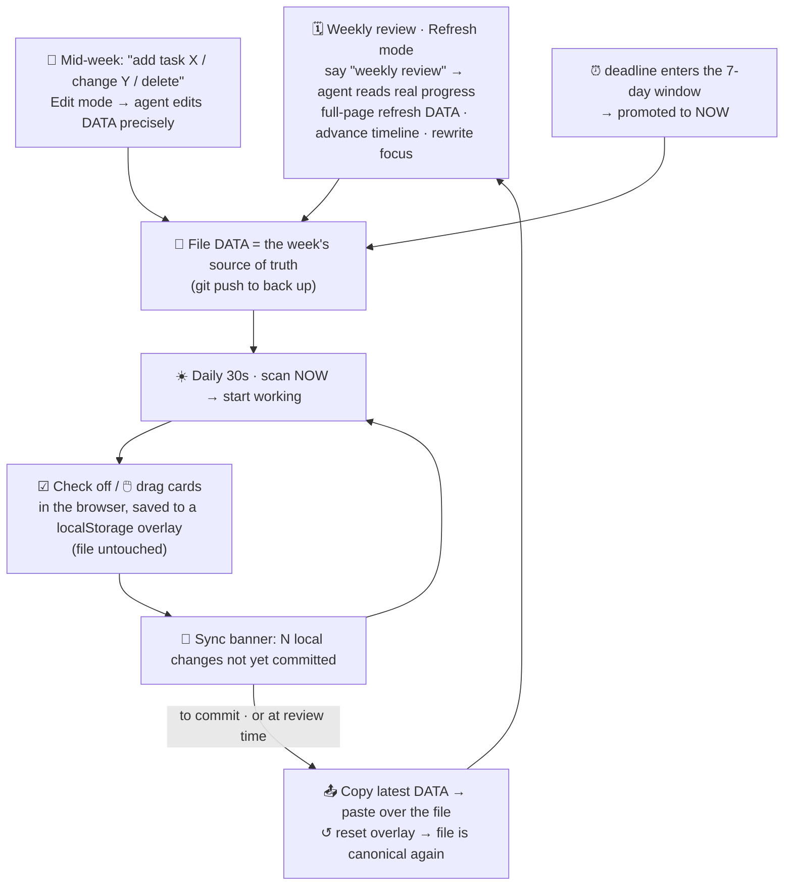

# life-kanban

[](https://github.com/suzyeth/life-kanban/actions/workflows/ci.yml)

A Claude Code skill for creating and maintaining a **single-file HTML personal kanban board** — a
"what should I look at / do right now" life + project dashboard.


<sub>Light theme (toggle with 🌗 or persisted per-browser):</sub>


## What it does

| Mode | Trigger | Result |
|---|---|---|
| **Create** | "make a board" / no board exists | Scaffolds `board.html` + `dashboard.css` + `dashboard-utils.js` from bundled templates, seeded with your real focus. |
| **Edit** | "add a task" / "check it off" / "move to today" / "delete" | Small precise edits to the top `DATA` block (add/move/complete/remove cards). |
| **Refresh** | "weekly review" / "refresh the board" / "start a new week" | Full-page reset for a new period — rolls columns, advances timeline, rewrites focus & NOT-NOW. |
| **Analyze** | "summarize" / "where am I" / "what's slipping" | Reads the board and reports per-track counts, NOW load, slips, nearest deadline. |

<sub>Triggers are examples — the skill also activates on the Chinese equivalents (做个看板 / 加一项 / 复盘 / 汇总 …).</sub>

## Workflow loop

How the pieces fit in real use: a **weekly big loop** (the agent refreshes the file) wrapped around a
**daily micro-loop** (you tick/drag in the browser), with mid-week edits and deadline promotion feeding
the file. The file `DATA` is canonical; browser edits live in a localStorage overlay until synced back.



- **Weekly** — the agent does a full Refresh; the file becomes the single source of truth again.
- **Daily** — you only tick/drag in the browser; changes accumulate in the overlay (the banner shows how many aren't committed).
- **Mid-week** — to add/change a task just say so (Edit) and the agent edits the file; a deadline entering the 7-day window gets promoted to NOW.
- **Commit** — anytime (or before the next review) hit 📤 Copy latest DATA, paste it back, and the overlay clears — looping back to the weekly review.

## The board

One HTML file. The `DATA = {...}` block at the top is the **single source of truth**; the render
script below it is generic. Features:

- 3 columns — 🔥 NOW·Today / 📅 This week / ⏭ NEXT&LATER
- **Data-driven color tracks** (define categories in `DATA.tracks`, CSS injected at runtime)
- Auto progress bar (from `week[]` done ratio)
- Non-linear (log-scale) long-range timeline — near-term magnified
- Clickable legend filter + show/hide-done toggle
- **Instant search** box — live-filter cards by text, stacks with the track filter
- **Keyboard shortcuts** — `/` search · `1-9` switch track · `a` all · `d` show/hide done · `p` print · `Esc` clear
- **Copy today** button — copy the NOW column as plain text for a daily note / standup
- **Print stylesheet** — `Ctrl/⌘+P` exports a clean light-theme PDF (expands all cards, ignores filters)
- **In-browser check + drag + add** — tick a card's ☑, drag it between/within columns, or **+ Add card** inline per column — all *without editing the file*
- **Due dates** — optional `due` per card → overdue cards get a red outline, a due chip, and a NOW "today" summary line (`4 tasks · 1 ⭐ · 1 P0 · 0 done · 1 overdue`)
- **First-screen focus** — in-flight / timeline / not-now / redlines collapse into a fold by default, so the 30s glance lands on NOW + this week
- **localStorage overlay + one-click sync** — browser edits persist locally as an overlay; a banner shows pending changes with **📤 Copy latest DATA** (paste back into the file = commit) and **↺ Reset local changes**. The file `DATA` block stays the single source of truth.
- **🌗 Light / dark theme** toggle (persisted per browser)
- **Multi-board nav** — `DATA.nav` renders a sub-page chip row to link several boards (work / life / …) that share `dashboard.css` + `dashboard-utils.js`
- NOT-NOW + redlines rails
- Optional: generic "in-flight tracking" table, markdown mirror, custom modules, sub-pages
- Dark GitHub theme, zero dependencies, opens by double-click

## Layout

```
life-kanban/
├── SKILL.md                       # workflow: detect mode → Create/Edit/Refresh/Analyze → verify
├── README.md
├── assets/
│   ├── kanban-template.html       # generic render-complete skeleton (copy, edit DATA)
│   ├── dashboard.css              # shared dark-theme base + light theme
│   ├── dashboard-utils.js         # esc / daysSince / daysClass / showDateWarning
│   └── kanban-template.md         # optional terminal-readable mirror
├── references/
│   ├── data-schema.md             # full DATA field reference + overlay model
│   ├── maintenance-rhythm.md      # daily/weekly/deadline conventions + refresh checklist
│   ├── customization.md           # tracks, colors, themes, multi-board, sub-pages
│   └── self-test.md               # manual ~1-min smoke recipe
├── tests/                         # Playwright headless tests (board.spec.mjs + serve.mjs)
├── playwright.config.mjs
└── .github/workflows/ci.yml       # runs the tests on every push / PR
```

## Tests

Headless [Playwright](https://playwright.dev) smoke tests cover render, dynamic track color, search,
keyboard shortcuts, check-off + overlay + sync banner, drag-to-column persistence, theme toggle, and
reset. They run on every push via GitHub Actions.

```bash
npm install
npx playwright install chromium   # first run only
npm test
```

## Design principles

Fits on one screen · reality-calibrated (refresh from real files, not memory) · deadlines first ·
dare to mark NOT NOW · slip honestly. See `references/maintenance-rhythm.md`.
