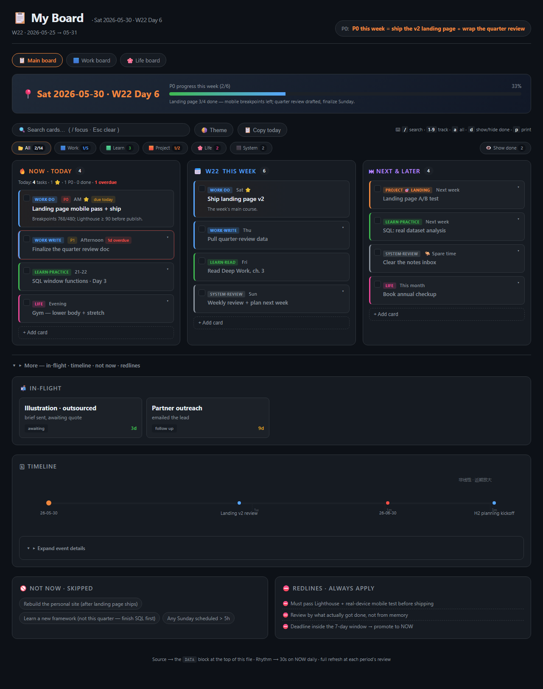
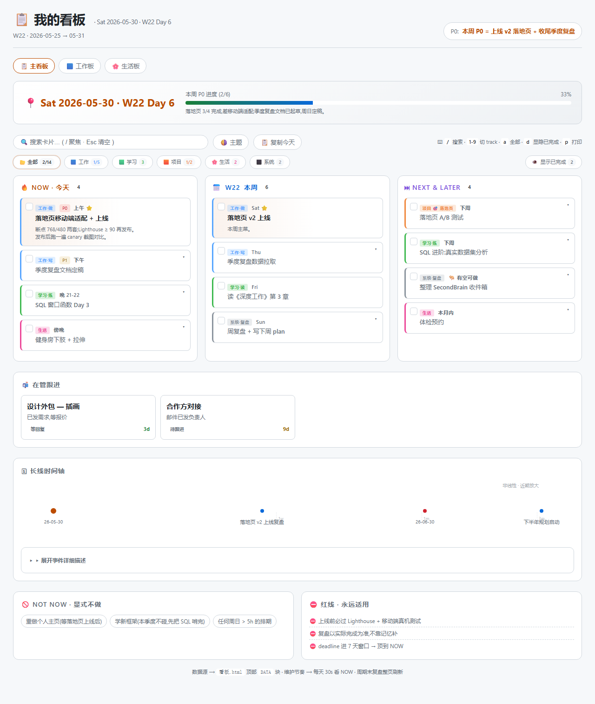
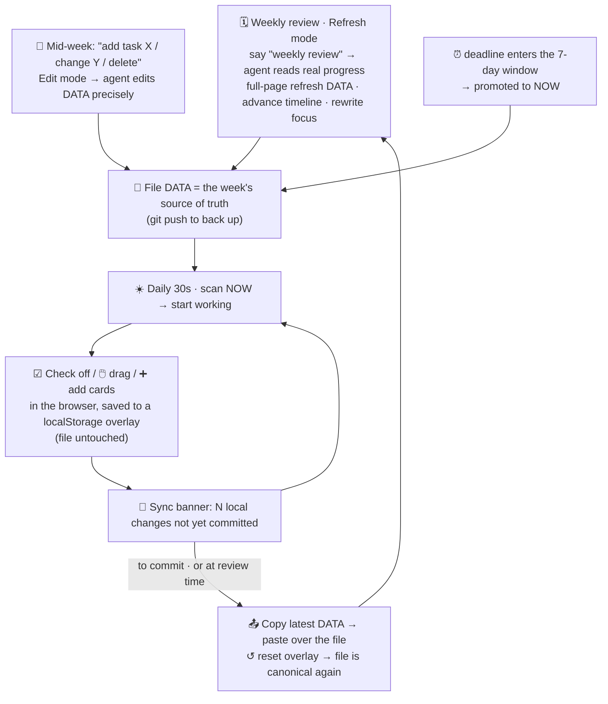

# 📋 life-kanban

[](https://github.com/suzyeth/life-kanban/actions/workflows/ci.yml)
[](LICENSE)

> A single‑file HTML kanban for your life + projects — the board you glance at to answer
> **"what should I be doing right now?"** Drive it by talking to Claude, or just open the file.

One HTML file. A `DATA = {…}` block at the top is the **single source of truth**; the generic engine
(`lk-engine.js`, shared verbatim by every board) below it never changes. You tick / drag / add cards in
the browser (saved to a localStorage overlay), and a [Claude Code](https://docs.anthropic.com/en/docs/claude-code)
**skill** maintains the file in plain language. Dark + light theme, zero dependencies, opens by double‑click.



<sub>Light theme (🌗 toggle, persisted per browser):</sub>



---

## Why

- **One screen, one question.** NOW · This week · NEXT, with the daily stuff up top and everything else
  folded away — the 30‑second glance lands on today, not a wall of backlog.
- **The file is the truth.** Everything lives in one diff‑able `DATA` block you can git‑version. Browser
  edits are an ephemeral overlay you sync back with one click — no database, no lock‑in.
- **Maintained in plain language.** "add a task", "weekly review", "what's slipping" — the skill makes
  the precise edits so you don't hand‑edit JSON.
- **Zero dependencies.** No build, no server, no account. Double‑click the HTML.

## Install & use

### A. As a Claude Code skill (recommended)

```bash
git clone https://github.com/suzyeth/life-kanban ~/.claude/skills/life-kanban
```

Then just talk to Claude Code:

> **"make a life kanban"** → it asks a few quick questions and scaffolds your board
> **"add 'ship landing page' to today"** · **"check off the SQL task"** · **"weekly review"** · **"what's slipping?"**

It also activates on the Chinese equivalents (做个看板 / 加一项 / 复盘 / 汇总 …).

### B. Standalone (no AI)

```bash
cp assets/kanban-template.html board.html
cp assets/dashboard.css assets/dashboard-utils.js assets/lk-engine.js .
```

Edit the `DATA` block at the top of `board.html` (schema → [`references/data-schema.md`](references/data-schema.md)),
then double‑click it. Everything works without Claude — the skill is just a nicer way to edit the file.

## The four modes

| Mode | Say… | What happens |
|---|---|---|
| **Create** | "make a board" | A short intake (areas / cadence / focus / what you're *not* doing) → a board seeded with your real priorities. |
| **Edit** | "add a task" · "check it off" · "move to today" · "delete" | Small precise edits to the `DATA` block. |
| **Refresh** | "weekly review" · "start a new week" | Full‑page reset for the next period — rolls columns, advances the timeline, rewrites focus. |
| **Analyze** | "where am I?" · "what's slipping?" | Reads the board → per‑track counts, NOW load, slips, nearest deadline. |

## What's on the board

**Glance & structure**
- 3 columns — 🔥 NOW·Today / 📅 This week / ⏭ NEXT&LATER
- **Data‑driven color tracks** — define your categories in `DATA.tracks`; colors + legend filters generate themselves
- **🎯 Goals** — `DATA.goals` link tasks to a "why"; a goals strip shows auto‑progress and filters to a goal's cards
- **Recurring tasks** — `repeat` on a card (weekly / Mon,Wed,Fri / monthly) regenerates it each Refresh instead of dropping it
- **🔁 Habits** — `DATA.habits` renders a 7‑day streak grid; tick a day in‑browser (🔥 streak + `n/target this week`), synced back like any overlay edit — the habit tracking other apps paywall, free and local
- **Today summary** line (`4 tasks · 1 ⭐ · 1 P0 · 0 done · 1 overdue`) + auto progress bar
- **Due dates** → overdue cards get a red outline + chip
- Non‑linear (log‑scale) long‑range **timeline** (filter by event type — deadline / milestone / visa), **NOT‑NOW** + **redlines** rails
- **Backlog stays calm** — the NEXT column folds past `DATA.nextFoldAfter` (default 8) behind a "▸ show N more" toggle, auto‑expanding while you search/filter
- **📒 Review log** — each weekly Refresh archives the closing period (completion‑rate trend bar + a one‑line retro + a "neglected track" flag), so the board has a *memory*, not just a snapshot
- **⚡ Attention strip** — on open, surfaces nudges: "Nd since last refresh", "deadline in 3d", "N overdue in NOW"
- **First‑screen focus** — in‑flight / timeline / not‑now / redlines fold away by default · responsive on mobile

**Daily use — all in the browser, no file edit**
- ☑ check off · ✎ **edit inline** (title · details · tag · track · due date · ⭐) · ➕ **+ Add card** with **quick-capture tokens** (`周三 投简历 #求职 P0 !` → day + track + tag + star, rest is the title) · **↩︎ undo** any of it with `Ctrl/⌘+Z`
- **move a card** three ways: 🖱️ drag · ⌨️ focus its ⠿ handle → ← → change column, ↑ ↓ reorder · 👆 **tap ⠿ then tap a column** (touch‑friendly)
- 🔍 instant search · ⌨️ shortcuts (`/` `1‑9` `a` `d` `p` `Esc` · `Ctrl/⌘+Z` undo) · 📋 Copy today · 🖨️ print to clean PDF · 🌗 theme
- ♿ **a11y & mobile** — every card is a keyboard‑operable group with an `aria-label` carrying its track + state (done / overdue / starred); columns stack and tap targets grow on small / touch screens

**Source of truth & sync**
- The `DATA` block stays canonical; browser edits are a **localStorage overlay**
- A sync banner offers **📤 Copy latest DATA** (paste back = commit) and **↺ Reset**
- **Multi‑board** — `DATA.nav` links several boards (work / life / …) that share the same CSS + JS

## Workflow loop

A **weekly big loop** (the skill refreshes the file) wraps a **daily micro‑loop** (you tick/drag in the
browser); mid‑week edits and deadline promotion feed the file. The `DATA` block is canonical; browser
edits live in an overlay until synced back.



## One engine, many boards

Every board — the template and any real board — loads the **same** `lk-engine.js` (and `dashboard.css`
/ `dashboard-utils.js`). A board is just: those three files copied in + a `DATA` block + two optional
hooks. Fix a bug once in the engine, re-copy, every board benefits.

- **Localization** — the engine is language‑neutral; all user‑facing strings default to English and are
  overridden by a `window.LK_I18N = { … }` object (plain strings or `(args)=>string` functions). Define
  it in a `<script>` **before** `lk-engine.js`. It lives outside `DATA`, so the "📤 Copy latest DATA"
  round‑trip never touches it.
- **Plugins** — bespoke sections a particular board needs (e.g. a weight tracker, an applications table)
  are functions on `window.LK_PLUGINS = [fn, …]`, each run once after first paint with a context
  `{ DATA, M, STR, todayDate, toLocalDate, dayMs, repaint, effDone, bucket, esc }`. They render into their
  own DOM nodes; the engine owns the columns / legend / goals / timeline / ledger.
- **Goals, two ways** — a goal with `track:"x"` derives progress from that track (click → filter the
  track); a goal with no track derives from cards that link via `goal:"<id>"` (click → filter those).

```html
<script>const DATA = { /* … */ };</script>
<script>
  window.LK_I18N = { all: "📂 全部", showDone: "显示已完成", summary: o => `今天: ${o.n} 项…` /* … */ };
  window.LK_PLUGINS = [ function renderHealth(ctx){ /* read ctx.DATA.health → render */ } ];
</script>
<script src="dashboard-utils.js"></script>
<script src="lk-engine.js"></script>
```

## Layout

```
life-kanban/
├── SKILL.md                     # the skill workflow: detect mode → Create/Edit/Refresh/Analyze → verify
├── assets/
│   ├── kanban-template.html     # the board markup + DATA block (copy, edit DATA)
│   ├── lk-engine.js             # the shared, language-neutral render/overlay/drag/sync engine
│   ├── dashboard.css            # dark + light theme base
│   ├── dashboard-utils.js       # esc / date helpers / stale-date banner
│   └── kanban-template.md       # optional terminal-readable mirror
├── references/                  # data-schema · maintenance-rhythm · customization · self-test
├── tests/                       # Playwright headless tests (board.spec.mjs + serve.mjs)
└── .github/workflows/ci.yml     # runs the tests on every push / PR
```

## Tests

Headless [Playwright](https://playwright.dev) specs cover render, dynamic track color, search, keyboard
shortcuts, check‑off + overlay + sync banner, drag‑to‑column, add card, due/overdue summary, theme, and
reset — green on every push via GitHub Actions.

```bash
npm install
npx playwright install chromium   # first run only
npm test
```

## Design principles

Fits on one screen · reality‑calibrated (refresh from real files, not memory) · deadlines first ·
dare to mark NOT NOW · slip honestly. See [`references/maintenance-rhythm.md`](references/maintenance-rhythm.md).

## License

[MIT](LICENSE) © Ziwei Su
